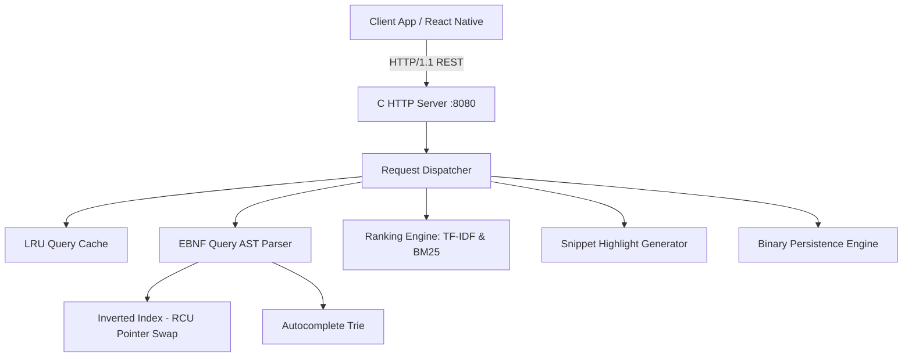

# CWeb Backend Architecture

## 1. System Design Overview

CWeb is a self-hosted, concurrent search engine written in C17. It operates over a local HTML corpus, exposing a REST API to thin client applications.

## 2. Concurrency & RCU Pointer Swap Model
Read operations (`/search`, `/suggest`, `/page/:id`) acquire a shared read lock (`pthread_rwlock_rdlock`). Index rebuilds (`POST /index/rebuild`) run off-thread to parse HTML pages into a standalone candidate index instance without blocking active readers. Once complete, an atomic pointer swap replaces the active index under a write lock (`pthread_rwlock_wrlock`).

## 3. LRU Query Cache
The query engine maintains an in-memory doubly linked list + hash map LRU cache (capacity: 256). Exact hit queries return pre-rendered JSON payloads in sub-millisecond speeds.

## 4. Multi-Threaded Server Architecture
The HTTP server uses a POSIX / Winsock thread pool model (`size = 8`). Incoming socket connections are accepted and handed off to worker threads. A token-bucket algorithm per client IP enforces 20 RPS rate limiting.
